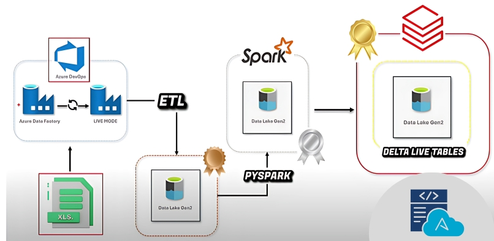

# 🛠️ End-to-End Data Engineering Pipeline with Medallion Architecture

This project demonstrates the implementation of a modern, scalable **ETL data pipeline** using the **Medallion Architecture** (Bronze → Silver → Gold) with the Azure ecosystem and **Databricks Delta Live Tables**.

## 🚀 Project Overview

The objective was to ingest Excel files, perform transformations, and deliver clean, structured, and queryable data using best practices in data engineering.

### ✅ Key Features

- **Azure Data Factory (ADF)** for data ingestion
- **Azure DevOps** integration for CI/CD and pipeline automation
- **Azure Data Lake Gen2** for storing raw, clean, and curated data
- **PySpark** for scalable data transformation
- **Delta Live Tables** for building reliable and trackable data flows
- **Warehouse integration** for final data consumption

---

## 🧱 Medallion Architecture Breakdown

- **Bronze Layer**: Raw data ingested from Excel files using Azure Data Factory
- **Silver Layer**: Cleaned and transformed data using PySpark
- **Gold Layer**: Business-level curated data modeled using Delta Live Tables

This layered approach improves data governance, traceability, and reliability.

---

## 🧰 Tools & Technologies Used

| Tool              | Purpose                               |
|-------------------|----------------------------------------|
| Azure Data Factory| Orchestration and Data Ingestion       |
| Azure DevOps      | CI/CD Automation                       |
| Data Lake Gen2    | Scalable Data Storage                  |
| PySpark           | Data Processing and Transformation     |
| Databricks        | Delta Live Tables and Notebook Dev     |
| Delta Lake        | Real-time and Incremental Processing   |

---

## 📊 Pipeline Flow Diagram

XLSX Files (.xlsx)  
        ↓  
Azure Data Factory (ADF)  
        ↓  
Data Lake Gen2 (Bronze Layer)  
        ↓  
PySpark Transformations  
        ↓  
Data Lake Gen2 (Silver Layer)  
        ↓  
Delta Live Tables  
        ↓  
Data Lake Gen2 (Gold Layer)  
        ↓  
Warehouse (Reporting Layer)

## Project Architecture

## Author
Amit Karmakar 
LinkedIn - https://www.linkedin.com/in/amit-karmakar-355817258/

